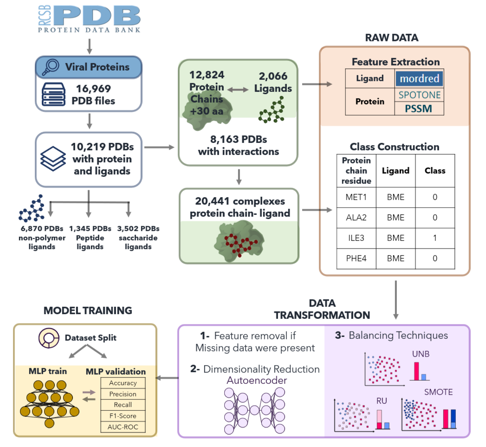

# ViralBindPredict

## Abstract
The development of a single drug can cost up to 1.8 billion USD and require over a decade, timelines that contemporary pharmaceutical companies seek to expedite. Computational methodologies have become integral to drug discovery; however, traditional approaches, such as docking simulations, often rely on protein and ligand structures that are unavailable, incomplete, or lack sufficient accuracy. Notwithstanding advances such as AlphaFold in predicting protein structures, these models are not always sufficiently precise for identifying Ligand-Binding Sites (LBS) or Drug-Target Interactions (DTI). In this study, we introduce ViralBindPredict, an innovative Deep-Learning (DL) model designed to predict LBS in viral proteins using sequence-based data. Our approach leverages sequence-derived information from the Protein Data Bank (PDB), offering a faster and more accessible alternative to structure-based methods. ViralBindPredict classifies viral protein residues as interacting or non-interacting with ligands based on a 5 Å threshold, unlocking new avenues for antiviral drug discovery. To enhance performance, we extracted advanced descriptors from protein-ligand complexes and applied autoencoders for dimensionality reduction of protein features. ViralBindPredict was rigorously evaluated across key metrics, achieving an accuracy of 0.68, AUC-ROC of 0.74, F1-Score of 0.65, precision of 0.69, and recall of 0.62. These results establish ViralBindPredict as an effective instrument for accelerating drug development, especially in the realm of antiviral treatment, where time and resource limitations are often crucial. The ability of the model to overcome conventional constraints and generate dependable predictions demonstrates its potential to substantially influence the pharmaceutical industry.

__Keywords:__ Viral Drug Discovery; Viral Drug-Target Interactions; Viral Ligand Binding Site; Deep Learning; Supervised Learning; Neural Networks.



## Requirements

A suitable [conda](https://conda.io/) environment named `ViralBindPredict` can be created and activated with:

__Note:__ This project was designed to run on Linux. To install the requirements on Linux, use the following commands:

```bash
conda env create -f environment.yml
conda activate ViralBindPredict
```

__Note:__ If you are running this project on Windows and get an encoding-related error, please run the following command in the terminal before running the project. You might need to install Windows Subsystem for Linux (WSL) and Ubuntu on Windows before running the project.
 
```bash
set PYTHONUTF8=1
```
__Note:__ If you are running this project on a Mac, please install the required packages manually. You may need to run the following command initially: `conda config --append channels conda-forge`

```bash
# access pytorch and select your device choices: https://pytorch.org
# run command presented by pytorch for your device
# our pytorch installation: conda install pytorch torchvision torchaudio pytorch-cuda=12.1 -c pytorch -c nvidia
conda create -n ViralBindPredict
conda activate ViralBindPredict
conda install torch torchmetrics torchinfo numpy h5py tqdm dill wandb imbalanced-learn scikit-learn scipy pyarrow rdkit mordred requests biopython pandas imblearn pyaml
```

Before running this project:

Please go to [models/config-files/config-mlp-example-predict.yaml](models/config-files/config-mlp-example-predict.yaml) and put your wandb profile name in entity.

__Note:__ To use WandB, you need to create an account at https://wandb.ai/ and follow the instructions to set up your account. When prompted, you might need to provide your API key.

## Uniref100 database
It is necessary to manually download the uniref100 database from [UniProt](https://ftp.uniprot.org/pub/databases/uniprot/uniref/uniref100/uniref100.fasta.gz) website.
The file has approximately 116 GB when unziped.
__Note:__ If you are running the project locally and have limited space, please consider using UniRef50 [UniProt](https://ftp.uniprot.org/pub/databases/uniprot/uniref/uniref50/uniref50.fasta.gz) instead of UniRef100. To do this, simply replace "uniref100" with "uniref50" wherever it appears. However, please note that UniRef50 offers reduced sequence coverage compared to UniRef100, which may affect the sensitivity and diversity of your analysis.

To convert this file to Blast database format on Linux or Ubuntu, use:

```bash
sudo apt-get -y install ncbi-blast+
makeblastdb -in <path_to_fasta_file>/uniref100.fasta -dbtype prot -out uniref100_db
```

__Note__: If you are running this project on a Mac, ensure that you have brew installed. Then, run the following command:

```bash
brew install blast
makeblastdb -in <path_to_fasta_file>/uniref100.fasta -dbtype prot -out uniref100_db
```
__Note:__ Please ensure that your directory paths do not contain any spaces to avoid potential errors during execution.

## Feature Extraction:

To make a new protein chain residue-compound prediction, it is necessary to have:
- .smi input file: ligand SMILE information and ligand name.
- .fasta input file: protein sequence information in FASTA format.
- The Blast database folder extracted from uniref100.fasta using makeblastdb.

To run the complete feature extraction process:

```
python feature_extraction.py --ligand_input_path <path_smi_file> --protein_input_path <path_fasta_file> --blast_database_path <path_blastdb_folder>
```

Retrieved features will be saved in three .hdf5 files:
- prediction/data/h5_files/mordred.hdf5
- prediction/data/h5_files/spotone.hdf5
- prediction/data/h5_files/pssm.hdf5
- prediction/new_prediction/new_prediction.hdf5 (containing all features together)

## Dimensionality Reduction—Autoencoder
After feature extraction, data dimensionality reduction was performed.
The Python script autoencoder.py is designed to train an autoencoder model that encodes and reconstructs protein molecular descriptors.

To train an autoencoder, based on a dataset with features and a config file:

```bash
usage: autoencoder.py [--dataset DATASET DATASET DATASET] [--model MODEL] [--config CONFIG CONFIG] [--device DEVICE] [--wandb {online,offline,disabled}]

--dataset DATASET DATASET DATASET
          <hdf5 dataset filepath> {interactions, proteins, ligands} {residue, chain}
--model MODEL
        <torch model filepath>
--config CONFIG CONFIG
         {<yaml sweep config filepath>, <wandb sweep author/project/id>} <number of runs>
--device DEVICE
         <torch device>
--wandb {online,offline,disabled}
```

Autoencoder Examples using [example-train.hdf5](example_datasets/example-train.hdf5) dataset:
- Example 1: create new model, use local config file and upload results to wandb (autoencode protein features, chain granularity)

```bash
python autoencoder.py --dataset example_datasets/example-train.hdf5 proteins chain --config models/config-files/config-ae.yaml 10 --device cuda:0 --wandb online
```

- Example 2: reuse model, associate run to already existing sweep and save results locally (autoencode protein features, residue granularity)

```bash
python autoencoder.py --dataset example_datasets/example-train.hdf5 proteins residue --model models/ae-model.pt --config wandb_user/wandb_project/wandb_sweep_id 10 --device cpu --wandb offline
```

- Example 3: create new model, associate run to already existing sweep and upload results to wandb (autoencode protein and ligand features, residue granularity)

```bash
python autoencoder.py --dataset example_datasets/example-train.hdf5 interactions residue --config wandb_user/wandb_project/wandb_sweep_id 10 --device cuda:0 --wandb online
```

## Multilayer Perceptron
After data dimensionality reduction with an autoencoder, data was used to train a Multilayer Perceptron (MLP) model.
The Python script multilayer_perceptron.py trains a MLP model on interaction datasets with support for hyperparameter tuning via Weights & Biases (WandB). The script is designed for binary classification tasks involving interaction data, providing configurable architectures, training metrics, and options for balanced datasets.

To train a MLP model with transformed data after dimensionality reduction:

```bash
usage: multilayer_perceptron.py [--dataset DATASET DATASET DATASET] [--model MODEL] [--config CONFIG CONFIG] [--device DEVICE] [--wandb {online,offline,disabled}]

--dataset DATASET DATASET DATASET
          <hdf5 dataset filepath> {interactions, balanced-interactions} {residue, chain}
--model MODEL
        <torch model filepath>
--config CONFIG CONFIG
         {<yaml sweep config filepath>, <wandb sweep author/project/id>} <number of runs>
--device DEVICE
         <torch device>
--wandb {online,offline,disabled}
```

MLP Examples using [example-train.hdf5](example_datasets/example-train.hdf5) for training and [example-predict.hdf5](example_datasets/example-predict.hdf5) dataset for prediction:

- Example 1: create new model, use local config file and upload results to wandb (train on protein and ligand features, residue granularity)

```bash
python multilayer_perceptron.py --dataset example_datasets/example-train.hdf5 interactions residue --config models/config-files/config-mlp.yaml 10 --device cuda:0 --wandb online
```
- Example 2: reuse model, associate run to already existing sweep and save results locally (train on protein and ligand features, chain granularity)

```bash
python multilayer_perceptron.py --dataset example_datasets/example-train.hdf5 interactions chain --model models/mlp-model.pt --config wandb_user/wandb_project/wandb_sweep_id 10 --device cpu --wandb offline
```
- Example 3: reuse model, use local config file and save results locally (test, chain granularity)

```bash
python multilayer_perceptron.py --dataset example_datasets/example-predict.hdf5 interactions chain --model models/mlp-silvery-sweep-16.pt --config models/config-files/config-mlp-example-predict.yaml 1 --wandb disabled
```

## NEW PREDICTION
The workflow predicts interactions between protein chains and compounds based on the provided input files: 

- Protein Chains (.fasta file): Each entry in the FASTA file corresponds to a protein chain. 
- Compounds (.smi file): Each line in the SMILES file corresponds to a compound.
- There must be the same number of protein chains and compounds in the input files.
- For interaction predictions, entry 1 in the .fasta file is paired with entry 1 in the .smi file, and so on:

Interaction example on example files in prediction/new_prediction/ folder:
- protein_predict.fasta has two protein entries (4tz2:A and 4tz2:A)
- ligand_predict.smi has two compounds (CHEMBL565765 and CHEMBL577478)
- ViralBindPredict will predict protein chain residue-compound interactions between protein chain 4tz2:A and compound CHEMBL565765; and between protein chain 4tz2:A and compound CHEMBL577478.

To run a new prediction, please make sure that you have the uniref100 database in your computer.

### 1- Feature extraction:

Input files:
- .smi input file: ligand SMILE information and ligand name. (example: [prediction/new_prediction/ligand_predict.smi](prediction/new_prediction/ligand_predict.smi)
- .fasta input file: protein sequence information in FASTA format (example: [prediction/new_prediction/protein_predict.fasta](prediction/new_prediction/protein_predict.fasta)
- Blast database folder extracted from uniref100.fasta using makeblastdb. Please replace the database location in the command. To run pssm, it is necessary to repeate the name of the database, as demonstrated in the example. You might need to change uniref100 to uniref100_db in the command.

Output file:
- prediction/new_prediction/new_prediction.hdf5 is a hdf5 file with protein chain residue and compound feature information

To run the complete feature extraction process:

```bash
python feature_extraction.py --ligand_input_path <path_smi_file> --protein_input_path <path_fasta_file> --blast_database_path <path_blastdb_folder>
```
Example using .smi and .fasta files present in the prediction/new_prediction folder:

```bash
python feature_extraction.py --ligand_input_path prediction/new_prediction/ligand_predict.smi --protein_input_path prediction/new_prediction/protein_predict.fasta --blast_database_path your/database/location/uniref100/uniref100
```

### 2- Dimensionality reduction and MLP Prediction:

Input file:
- .hdf5 file created with feature extraction (example: prediction/new_prediction/new_prediction.hdf5)

Output files:
- hdf5 file after autoencoder and data transformations (example: prediction/new_prediction/new_prediction_transformed.hdf5)
- a .csv file per interaction with ViralBindPredict protein chain residue-compound predictions (example: prediction/new_prediction/4tz2:A:CHEMBL577478.csv and prediction/new_prediction/4tz2:A:CHEMBL565765.csv)

To run dimensionality reduction and MLP prediction:

```bash
python prediction.py --hdf5_file_path <path_h5_file> --autoencoder_model_path <path_autoencoder_model> --mlp_model_path <path_mlp_model> --cuda_device_idx <cuda_device_index>
```
Example using new_prediction.hdf5 file present in the prediction/new_prediction folder:

```bash
python prediction.py --hdf5_file_path prediction/new_prediction/new_prediction.hdf5 --autoencoder_model_path models/ae-fanciful-sweep-308.pt --mlp_model_path models/mlp-silvery-sweep-16.pt --cuda_device_idx 0
```

## ViralBindPredictDB

Dataset __viralbindpredictDB.hdf5__ regarding protein chain/residue classification, Mordred, SPOTONE and PSSM features is available at [ViralBindPredict Dropbox](https://www.dropbox.com/scl/fo/nq47acmr2ty62iflu9rwn/AJhe9a9gqoKblgHkYDMf_Gk?rlkey=dcivaufhohazumpetifq9chkj&st=ac9imrzl&dl=0).
Folder [ViralBindPredictDB](ViralBindDB/) contains text files (_.txt_) with keys and descriptors from viralbindpredictDB.hdf5.
- class_keys.txt: file with the 20.441 class keys with nomenclature _PDB ID (4 letters) : Chain ID (1 letter) _ PDB Compound ID (3 letters)_, e.g., 102l:A_0BU.
- ligands.txt: file with the 2.066 ligand keys with nomenclature _PDB Compound ID (3 letters)_, e.g., 0BU.
- mordred_descriptors.txt: file with the 1514 Mordred features.
- proteins.txt: file with the 12.824 protein keys with nomenclature _PDB ID (4 letters) : Chain ID (1 letter)_, e.g., 102l:A.
- spotone_descriptors.txt: file with the 173 SPOTONE features.
- pssm_descriptors.txt: file with the 42 PSSM features.

## Folder organization:

[prediction/](prediction/) folder:
- Folder prediction/ has a sub-folder new_prediction/ that has example files to run a new prediction with [ligand information](prediction/new_prediction/ligand_predic.smi) and [protein information](prediction/new_prediction/protein_predict.fasta).
- After a new prediction run with those input files, new sub-folders prediction/data/features/ and prediction/data/h5_files/ folders are created with ligand and protein descriptors retrieved from Mordred, SPOTONE and PSSM. prediction/data/features/ saves features in .csv files and prediction/data/hdf5/ folder saves features in .hdf5 files.
- .hdf5 files are concatenated into prediction/new_prediction/new_prediction.hdf5 file to further proced to data transformation.
- prediction/new_prediction/new_prediction.hdf5 file is used to transform data, through an autoencoder and to select features used for model training. After this process, transformed data is saved in prediction/new_prediction/new_prediction_transformed.hdf5
- This .hdf5 file with transformed data is used for a new prediction, and at the end, the ViralBindPredict model predictions are saved as .csv files in the diretory prediction/new_prediction/.

prediction/ folder after running a prediction:

```bash
\$HOME\VirHostAI\prediction
   \data
      \features
         \mordred
            \CHEMBL565765.csv
            \CHEMBL577478.csv
         \spotone
            \4tz2:A.fasta_processed.csv            
         \pssm
            \4tz2:A.pssm
      \h5_files
         \mordred.hdf5
         \pssm.hdf5
         \spotone.hdf5
   \new_prediction
      \ligand_predict.smi
      \protein_predict.fasta
      \new_prediction.hdf5
      \new_prediction_transformed.hdf5
      \4tz2:A:CHEMBL565765.csv
      \4tz2:A:CHEMBL577478.csv
```

### Weight initialization
The weights of the models are initialized using a random approach with no fixed seed.

### If you use ViralBindPredict, please cite the following.
[ViralBindPredict: Empowering Viral Protein-Ligand Binding Sites through Deep Learning and Protein Sequence-Derived Insights] PENDING CITATION
