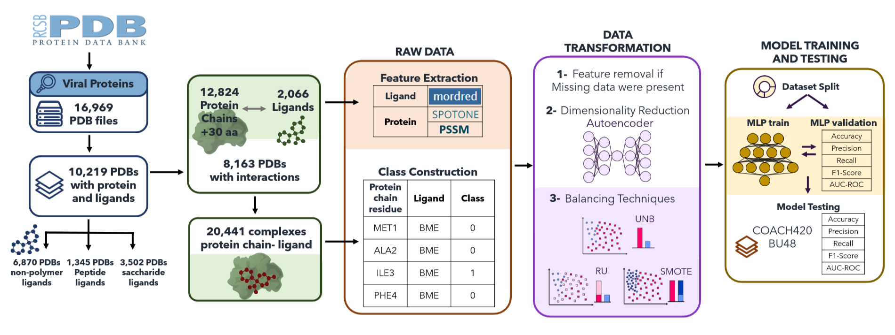

## ViralBindPredict

## Abstract:
The development of a single drug can cost up to 1.8 billion USD and require over a decade, timelines that contemporary pharmaceutical companies seek to expedite. Computational methodologies have become
integral to drug discovery; however, traditional approaches, such as docking simulations, often rely on protein   and   ligand   structures   that   are   unavailable,   incomplete,   or   lack   sufficient   accuracy.
Notwithstanding advances such as AlphaFold in predicting protein structures, these models are not always sufficiently precise for identifying Ligand-Binding Sites (LBS) or Drug-Target Interactions (DTI).
In this study, we introduce ViralBindPredict, an innovative Deep-Learning (DL) model designed to predict LBS   in   viral   proteins   using   sequence-based   data.   Our   approach   leverages   sequence-derived
information from the Protein Data Bank (PDB), offering a faster and more accessible alternative to structure-based   methods.   ViralBindPredict   classifies   viral   protein   residues   as   interacting   or   non-
interacting with ligands based on a 5 Å threshold, unlocking new avenues for antiviral drug discovery. To enhance performance, we extracted advanced descriptors from protein-ligand complexes and
applied autoencoders for dimensionality reduction of protein features. ViralBindPredict was rigorously evaluated across key metrics, achieving an accuracy of 0.68, AUC-ROC of 0.74, F1-Score of 0.65,
precision of 0.69, and recall of 0.62. These results establish ViralBindPredict as an effective instrument for accelerating drug development,
especially in the realm of antiviral treatment, where time and resource limitations are often crucial. The ability   of   the   model   to   overcome   conventional   constraints   and   generate   dependable   predictions
demonstrates its potential to substantially influence the pharmaceutical industry .

Key words: Viral   Drug   Discovery;   Viral   Drug-Target   Interactions;   Viral   Ligand   Binding   Site;   Deep   Learning;
Supervised Learning; Neural Networks.



### Prerequisites:
ViralBindPredict was developed and tested as follows:
* python - 3.11.6
* pytorch - 2.1.0
* torchmetrics - 1.2.0
* torchinfo - 1.8.0
* numpy - 1.26.0
* h5py  - 3.10.0
* imbalanced-learn - 0.11.0
* scikit-learn - 1.3.1
* scipy - 1.11.3
* tqdm - 4.66.1
* wandb - 0.15.12
* dill - 0.3.7
* MORDRED - version 1.2.0
* RDKit - version 2023.9.4

We recommend creating an isolated Conda environment to run our pipeline, which can be performed using the following code:
```bash
conda create --name ViralBindPredict python=3.9.16 -c conda-forge biopython pandas scipy h5py pyarrow numpy rdkit mordred requests
conda activate ViralBindPredict
```
Note: The environment name, defined after the "--name" argument in the first step, can be whatever the user desires.

Required information to replicate and run ViralBindPredict is described in this Repository.

### ViralBindPredictDB:
Data viralbindpredictDB.hdf5 file regardinig protein chain residue classification, Mordred descriptors and SPOTONE and PSSM features are available in this [link]().
./ViralBindPredictDB/ folder contains .txt files with keys and descriptors from viralbindpredictDB.hdf5:

 1) "class_keys.txt"- file with the 20.441 class keys (PDB:chain_compound).
 2) "ligands.txt"- file with the 2.066 ligand keys (PDB compound ID).
 3) "mordred_descriptors.txt"- file with the 1514 Mordred descriptors.
 4) "proteins.txt"- file with the 12.824 protein keys (PDB:chain).
 5) "spotone_descriptors.txt"- file with the 173 SPOTONE descriptors.
 6) "pssm_descriptors.txt"- file with the 173 PSSM descriptors.

### BU48dataset:
This directory holds the BU48 test dataset necessary to run the model, organized into two key components:

### A) dataset-bu48-transformed-1.hdf5:
This HDF5 file contains the BU48 dataset, which has been enhanced with three primary descriptor sets: Mordred descriptors (molecular fingerprints), SPOTONE descriptors (structure-based features), and PSSM (Position-Specific Scoring Matrix for sequence-based properties). Together, these descriptors cover a broad range of molecular and structural information about protein-ligand interactions.

### B) transformations-logs:
This folder includes a log file that details every preprocessing step applied to the BU48 dataset to ensure model compatibility. The transformations undertaken include:

- Chain Removal: Chains were filtered based on parameters such as zero values in Mordred features.
- Residue Removal: Residues containing NaN or inf values in descriptor readings were excluded to ensure data quality.
- Ligand Feature Removal: Selected ligand-specific features with NaN values were filtered out to refine the dataset.
- Ligand Removal: Ligands with NaN or inf values were removed to maintain the dataset’s integrity.
- Protein Feature Dimensionality Reduction: Using the autoencoder model ae-fanciful-sweep-308.pt, protein feature dimensionality was reduced from 216 to 60, improving computational efficiency.
- Final Dataset Packaging: The final dataset was compactly repacked with h5repack for streamlined access and querying, resulting in dataset-bu48-transformed-1.hdf5.

### models/config-files:
This folder includes configuration files that set up the hyperparameter searches for the Multi-Layer Perceptron (MLP) and Autoencoder models. Each configuration defines the search spaces and parameters used to optimize the models’ training and performance.

### A) config-ae.yaml - Autoencoder Configuration:
This file outlines the hyperparameter search for the Autoencoder model, using a random search approach aimed at minimizing the loss across training epochs. Key parameters include:

- encoder_layers: Specifies different layer architectures for the encoder, offering a range of layer sizes to adjust model depth and feature extraction capacity.
- latent_vector: Sets possible latent space dimensions, ranging from 180 down to 40.
- activation: Tests various activation functions (relu, leaky-relu, gelu) to find the most effective non-linear transformation.
- criterion: Uses Mean Squared Error (mse) as the loss function for model training.
- optimizer: Applies the adam optimizer to enable adaptive learning rates.
- learning_rate: Explores a range between 0.0001 and 0.01 for learning rate selection.
- splits: Sets a data split ratio of [0.9, 0.1, 0], allocating 90% of the data for training and 10% for validation.
- epochs: Tests epochs ranging from 6 to 14.
- batch_size: Evaluates batch sizes between 32 and 256 to ensure stability during training.
- shuffle: Shuffles data at each epoch to improve model generalization.

### B) config-mlp.yaml - MLP Configuration:
This file configures the hyperparameter search for the MLP model, using random search to minimize training epoch loss. Primary parameters include:

- layers: Defines options for MLP layer architecture and depth, such as num_layers, with flexible architecture types (e.g., =, <, >, <>).
- activation: Tests multiple activation functions (relu, leaky-relu, gelu, tanh, sigmoid) to evaluate non-linearity effects.
- optimizer: Tests both adam and sgd optimizers.
- learning_rate: Adjusts learning rates over a range from 0 to 0.1.
- splits: Data split configurations include options like [0.7, 0.3, 0] and [0.8, 0.2, 0].
- epochs: Ranges between 4 and 10 epochs.
- batch_size: Tests batch sizes from 32 to 512 to optimize training throughput.
- shuffle: Ensures data shuffling to enhance training robustness.

These configuration files allow extensive hyperparameter tuning, providing flexibility to adapt both models to the dataset’s specific requirements for optimal performance.

### Script files:
### autoencoder.py
This Python script is designed to train an Autoencoder model that encodes and reconstructs molecular descriptors for proteins. Model and configuration settings can be provided as command-line arguments.

USAGE:
```bash
python autoencoder.py --dataset <path_to_dataset> <dataset_type> <granularity> --model <path_to_model> --config <config_file> <wandb_sweep_id> --device <device_type> --wandb <wandb_mode>
```
- dataset: Specifies the path to the HDF5 dataset and granularity level (residues or chains).
- model: (Optional) Path to a pre-trained Autoencoder model file.
- config: YAML configuration file for hyperparameter sweeps and the WandB sweep ID.
- device: Specifies the device for training.
- wandb: Sets the WandB mode (online, offline, or disabled).

### dataset.py
The script defines custom dataset classes that load, process, and manage protein-ligand interaction data. These classes are designed to support:
- Flexible Granularity: Datasets can be accessed at different levels (residues or chains).
- Data Splits: Supports train, validation, and test splits as specified in the dataset.
- Balanced Datasets: Additional support for balanced batch handling with the BalancedInteractionsDataset.

### multilayer_perceptron.py
This Python script trains a Multilayer Perceptron (MLP) model on interaction datasets with support for hyperparameter tuning via Weights & Biases (WandB). The script is designed for binary classification tasks involving interaction data, providing configurable architectures, training metrics, and options for balanced datasets.

USAGE:
```bash
python multilayer_perceptron.py --dataset <path_to_dataset> <dataset_type> <granularity> --model <path_to_model> --config <config_file> <wandb_sweep_id> --device <device_type> --wandb <wandb_mode>
```
- dataset: Specifies the path to the HDF5 dataset and granularity level (residues or chains).
- model: (Optional) Path to a pre-trained Autoencoder model file.
- config: YAML configuration file for hyperparameter sweeps and the WandB sweep ID.
- device: Specifies the device for training.
- wandb: Sets the WandB mode (online, offline, or disabled).

### torch_map.py
This script defines mappings for common activation functions, loss functions (criterions), and optimizers to streamline model configuration.

### transformations.py
This script defines several functions for managing and transforming datasets. It includes support for removing or updating specific dataset features, handling missing values, and rebalancing data through oversampling and SMOTE. Additionally, it logs each transformation, providing transparency and reproducibility.

### If you use ViralBindPredict, please cite the following.

[ViralBindPredict: Empowering Viral Protein-Ligand Binding Sites through Deep Learning and Protein Sequence-Derived Insights] PENDING CITATION
